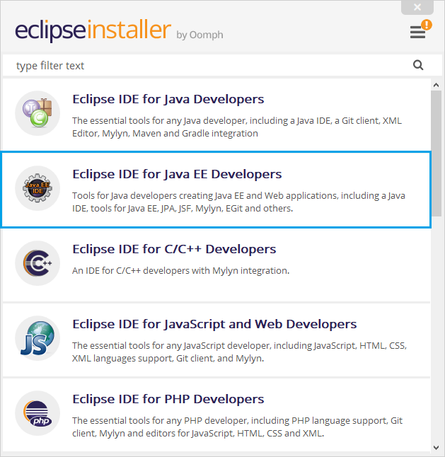
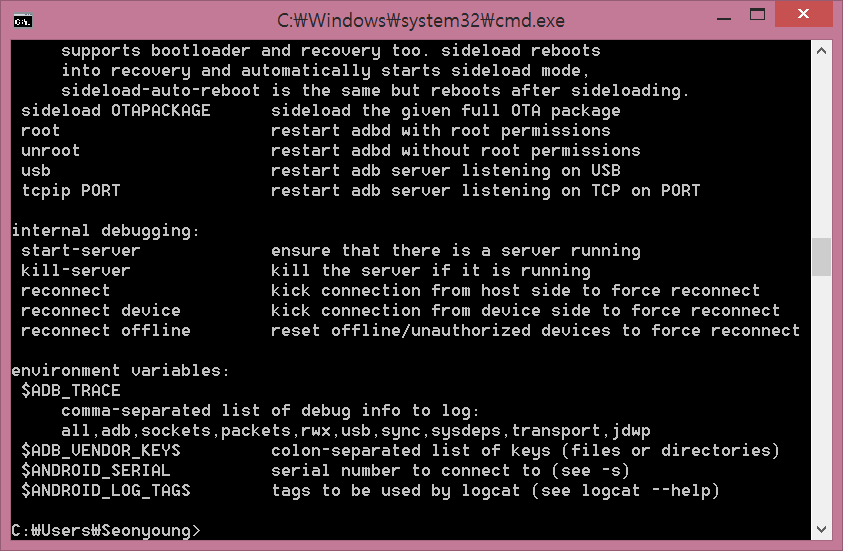

# APK 분석 TOOL 설치 메뉴얼

## 정적 분석

#### 1. JDK 설치 및 JAVA_HOME 환경 변수 설정
참고 사이트 : http://recipes4dev.tistory.com/50

#### 2. 이클립스 설치
1. www.eclipse.org에서 이클립스 installer를 다운로드
2. installer 실행
3. Ecplise IDE for JAVA EE Developers 설치
 
4. Install -> accept Now -> accept -> launch 클릭
5. 설치 완료

#### 3. ADB 설치
 1) downloads 폴더로 이동
 2) adb.zip 파일 다운로드
 3) zip 파일 해제 후
 3) 압축 파일을 해제한 후 해제한 폴더를 본인이 편한 위치에 둔다
 4) adb 폴더의 경로를 복사한다
 (ex) c:/adb
 5) 환경 변수 설정
	- cmd 창을 연다
	- sysdm.cpl 입력
	- 고급 탭 > 환경변수 > 시스템 변수 창에서 Path 변수를 클릭 > 편집 > 4에서 복사한 경로를 넣어준다
	- 확인을 눌러 저장
6) cmd 창을 띄운 후 adb 입력

위의 그림처럼 나와야 설치 완료

#### 4. apktool 설치

#### 5. dex2jar 설치
 1)

#### 6. jd_gui 설치
 1) Downloads 폴더로 이동
 2) jd-gui-0.3.6.windows.zip 파일 다운로드
 3) jd-gui.exe 실행(따로 설치 필요 없음)

 ## 2. 동적 분석
