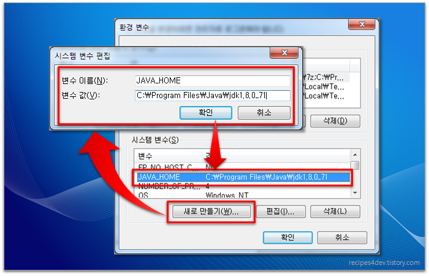
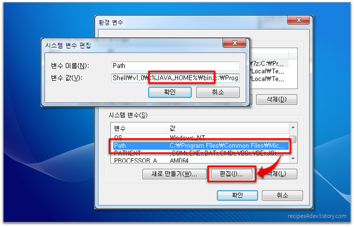
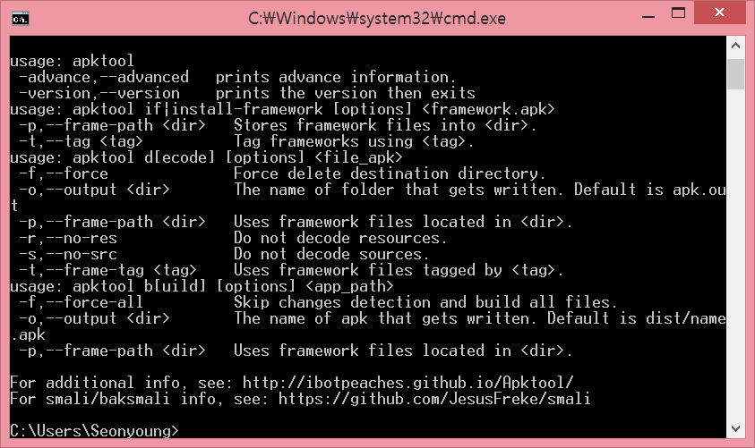
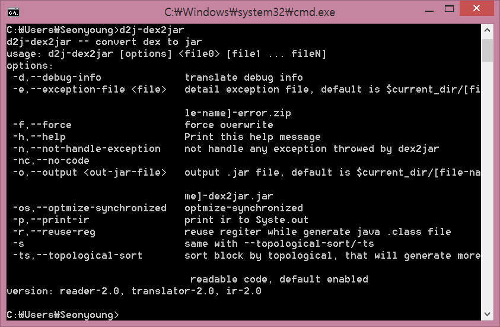
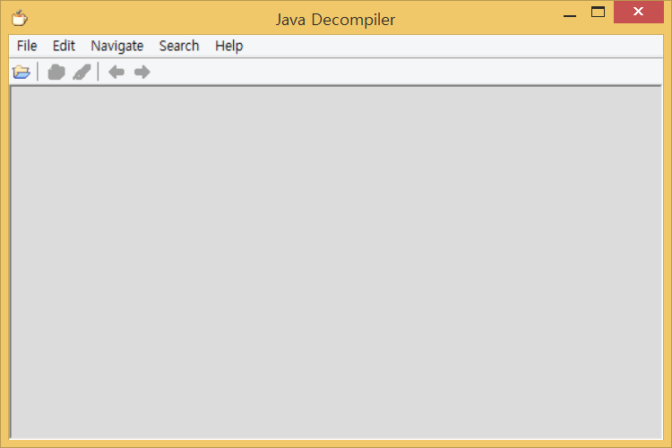

# APK 분석 TOOL 설치 메뉴얼

## 정적 분석

### 1. JDK 설치 및 JAVA_HOME 환경 변수 설정
 1. www.oracle.com 에서 [Downloads]-[Java SE] 메뉴를 선택
 2. JDK 파일을 다운로드하여 설치(jdk 파일의 설치 경로 복사해두기)
 3. JAVA_HOME 환경 변수 설정
    - cmd 창을 열고 sysdm.cpl 입력함
    - 고급 탭 > 환경변수 > 시스템 변수 창에서 새로 만들기 클릭 > 2에서 복사해둔 경로로 JAVA_HOME 환경변수 만들기
     
 4. Path 환경 변수 설정
    - 시스템 변수 창에서 Path 변수를 클릭 > 편집 > %JAVA_HOME%\bin; 경로 붙여넣기 > 확인
    
  - 참고 사이트 : http://recipes4dev.tistory.com/50

### 2. 이클립스 설치
 1. www.eclipse.org 에서 이클립스 installer를 다운로드
 2. installer 실행
 3. Ecplise IDE for JAVA EE Developers 설치
 
 4. Install -> accept Now -> accept -> launch 클릭

### 3. ADB 설치
 1. downloads 폴더로 이동
 2. adb.zip 파일 다운로드
 3. 압축 파일을 해제한 후 해제한 폴더를 본인이 편한 위치에 둔다
 4. 해제한 폴더의 경로를 복사한다
 (ex) c:\adb
 5. 환경 변수 설정
    - cmd 창을 열고 sysdm.cpl 입력함
    - 고급 탭 > 환경변수 > 시스템 변수 창에서 Path 변수를 클릭 > 편집 > 4에서 복사한 경로 붙여넣기 > 확인
 6. cmd 창을 띄운 후 adb 입력
 
위의 그림처럼 나와야 설치 완료

### 4. apktool 설치
 1. downloads 폴더로 이동
 2. apktool.zip 파일 다운로드
 3. 압축 파일을 해제한 후 해제한 폴더를 본인이 편한 위치에 둔다
 4. 해제한 폴더의 경로를 복사한다
 (ex) c:\apktool
 5. 환경 변수 설정
    - cmd 창을 열고 sysdm.cpl 입력
    - 고급 탭 > 환경변수 > 시스템 변수 창에서 Path 변수를 클릭 > 편집 > 4에서 복사한 경로 붙여넣기 > 확인
 6. cmd 창을 띄운 후 apktool 입력

위의 그림처럼 나와야 설치 완료

### 5. dex2jar 설치
 1. downloads 폴더로 이동
 2. dex2jar-0.0.9.15.zip 파일 다운로드
 3. 압축 파일을 해제한 후 해제한 폴더를 본인이 편한 위치에 둔다
 4. 해제한 폴더의 경로를 복사한다
 (ex) c:\dex2jar-0.0.9.15
 5. 환경 변수 설정
    - cmd 창을 열고 sysdm.cpl 입력
    - 고급 탭 > 환경변수 > 시스템 변수 창에서 Path 변수를 클릭 > 편집 > 4에서 복사한 경로 붙여넣기 > 확인
 6. cmd 창을 띄운 후 d2j-dex2jar 입력
 
 위의 그림처럼 나와야 설치 완료

### 6. jd_gui 설치
 1. Downloads 폴더로 이동
 2. jd-gui-0.3.6.windows.zip 파일 다운로드 및 압축 해제
 3. jd-gui.exe 실행(따로 설치 필요 없음)

 <실행 화면>

 ## 동적 분석
